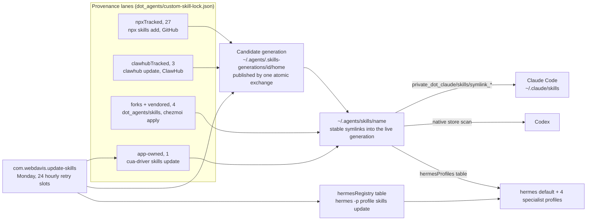

# Agent skills: the cross-harness store

`~/.agents/skills` is the single canonical skills store (35 roster skills). It serves Claude Code for the
roster minus the `claudeDelivery` `"none"` set (symlinks declared in chezmoi:
`private_dot_claude/skills/symlink_*`), Codex always (it scans the store natively, no declarations), and
hermes for exactly the store-symlink subset of the delivery model below
(`private_dot_hermes/private_skills/` and `private_dot_hermes/profiles/<name>/private_skills/` symlinks).

The committed roster is the complete wanted set. `test/unit/skills-roster-fanout.sh` fails the build if
the store, the lock's `tiers` / `claudeDelivery` / `hermesProfiles` / `hermesRegistry` / `npxTracked` /
`clawhubTracked` tables, the per-harness declarations, or the settings modify-template's `skillOverrides`
ever disagree.

The graph shows the lanes. The per-skill rows (which lane, which upstream, which tier, which profiles)
live in `dot_agents/custom-skill-lock.json`, which is the thing to read for any individual skill.

## Store provenance: who installs and refreshes each store copy

The lock at `dot_agents/custom-skill-lock.json` records it.

### npx-tracked (the `npxTracked` table, 27 skills)

The store copy is installed and refreshed by the official npx `skills` CLI from an official GitHub
upstream, latest from `main` (no pin).
`~/.local/libexec/unattended-upgrades/agent-skills/update-skills.sh` installs and refreshes them via an
explicit `npx --yes skills@latest add <repo> --skill <name> --agent claude-code --agent codex -g -y` per
repo group, run against the weekly candidate generation. It never uses the bulk `npx skills update`,
whose lock-walk logs some failures at exit 0; the explicit add also reconciles lock-absent roster skills.
Codex reads the store natively, so there is no Codex-side declaration. These skills are NOT vendored in
chezmoi.

Includes the 12 curated HeyGen HyperFrames skills (router `hyperframes`; domains `hyperframes-core`,
`-animation`, `-keyframes`, `-creative`; `media-use`, `hyperframes-cli`, `hyperframes-registry`;
workflows `general-video`, `faceless-explainer`, `embedded-captions`, `motion-graphics`), with `figma`,
`music-to-video` and the rest of that repo deliberately excluded.

Also includes `home-assistant-best-practices` (from the official `homeassistant-ai/skills` repo): Home
Assistant config and YAML authoring guidance, not runtime control. It complements the clawhub-tracked
`home-assistant` runtime skill everywhere, and it is the one Home Assistant skill that DOES fan out to
hermes (default profile), as authoring guidance atop Bob's native Home Assistant runtime tools.

Also includes the five `kepano/obsidian-skills` skills (`defuddle`, `json-canvas`, `obsidian-bases`,
`obsidian-cli`, `obsidian-markdown`), all on-demand, all `hermesProfiles: []`. Note what on-demand costs
`defuddle`: it advertises itself as an automatic substitute for WebFetch whenever a user pastes a URL, so
demoted it never fires unless the agent is told to use it. That is deliberate, and reverting it takes two
committed edits, the `tiers` value in the lock and the matching `skillOverrides` line in
`private_dot_claude/modify_settings.json`, because the roster test fails a core skill that still carries
an override.

### ClawHub-tracked (the `clawhubTracked` table, 3 skills)

`home-assistant`, `sql-toolkit` and `summarize-pro`. The store copy is installed and refreshed by the
`clawhub` CLI from ClawHub. The npx lane cannot source ClawHub (`npx skills add` is GitHub-only), so
ClawHub-only skills get their own auto-update lane instead of staying vendored. Each entry records the
owner-qualified slug and registry.

`update-skills.sh` installs an absent one in a throwaway `--workdir` and moves the CLI's output flat into
the candidate store. The CLI nests its output under `@owner/<name>`, and the code handles both that and a
flat `skills/<name>` path rather than assuming either; the skill's `.clawhub/origin.json` travels along
and pins the owner. The weekly lane then refreshes each in place with
`clawhub --workdir <candidate>/.agents --dir skills update <name> --no-input` (bare store names resolve
through `origin.json` even when several ClawHub users publish the name).

Two mechanical realities, verified live: Finder `.DS_Store` litter breaks the CLI's fingerprint match, so
it is scrubbed before the update, and the repo-asserted Codex overlay makes the CLI refuse with "local
changes". The pass sets exactly that one file aside after a byte-equal check and retries once. Any OTHER
local change is a required failure, which discards the whole candidate and withholds the week's success
stamp. Automation never passes `--force`, and never `--force-install` (ClawHub's scan bypass).

### Vendored (committed under `dot_agents/skills/`, refreshed only by `chezmoi apply`)

The `forks` table records each one's upstream for weekly drift-watch. `moshi` and `herdr` are deliberate
content forks (`fork: true`). `elevenlabs` is vendored because npx cannot install it full-tree (its
`SKILL.md` sits at the repo root beside a `scripts/` dir npx drops, even with `--full-depth`).
`tiktok-crawling` is the one plain committed dir with no `forks` entry: a ClawHub-published skill left
vendored because hermes owns its hub copy via `hermesRegistry` and its hub name differs from the roster
name (`tiktok-scraping-yt-dlp`).

### App-owned symlink (`cua-driver`)

The store entry is a symlink into `~/.cua-driver`; the app owns the content. The official mechanism
covers all three harnesses (`cua-driver skills status` links Claude Code, Codex via the store, and hermes
itself), and the weekly run refreshes the pack via `cua-driver skills update`, the app's own
GitHub-Releases updater, never a write through the symlink.

## Claude delivery (the lock's `claudeDelivery` table)

A store entry mapped to `"none"` is one this vertical deliberately does NOT deliver to Claude Code. It
carries no `private_dot_claude/skills` declaration and `update-skills.sh` skips it in the weekly Claude
fan-out, so a `~/.claude/skills` link removed by hand stays removed instead of coming back on the next
Monday. An absent key is the default, a store symlink. `last30days` is the one entry today.

The table states only what THIS vertical does: it names no other delivery mechanism and reads no other
lock, per the operator's strict-decoupling ruling. `"none"` is the only legal value, and a malformed
table refuses the run rather than failing open, in every mode including `--dry-run`.

**Retiring an EXISTING link is manual, and the run says so.** Deleting the chezmoi declaration does not
remove a `~/.claude/skills` link already on the machine (chezmoi never deletes a target it no longer
manages), and the apply-time `--install-only` pass is additive, so it removes nothing either. The link
therefore survives until the next full weekly run reaps it, and for that window Claude Code sees two
sources under one name. `converge_dir` WARNs with the absolute path in the additive mode, naming what it
is leaving behind for the operator to delete. No removal is scripted, by operator ruling.

## Tier model (the lock's `tiers` table)

Every roster skill is `core` (8) or `on-demand` (27). Core skills auto-load in every harness; on-demand
skills stay installed everywhere but load only when explicitly invoked:

- Claude Code: `skillOverrides.<name> = "user-invocable-only"`, one `setValueAtPath` per skill in the
  settings modify-template. The write is per key, so overrides the user sets for other skills drift
  freely.
- Codex: an additive `agents/openai.yaml` carrying `policy: allow_implicit_invocation: false`. Codex then
  never auto-invokes the skill, while explicit `$name` invocation keeps working.

The overlay is committed next to each on-demand vendored skill; core vendored skills carry none, and
`update-skills.sh` actively strips a policy block from a core skill. For npx- and clawhub-tracked skills
(whose folders the add and update passes replace wholesale) `update-skills.sh` re-asserts the overlay on
every run from the tiers table, and when an upstream skill ships its own `agents/openai.yaml` the policy
is APPENDED so upstream metadata survives, never overwritten. Store entries that are SYMLINKS to
app-owned content (`cua-driver`) never get an overlay, since writing through the link would modify
content this repo does not own, so `cua-driver` stays implicitly invocable in Codex (a deliberate,
documented asymmetry).

## Hermes delivery is two-lane, under the five-profile architecture

The profiles are default (Bob), elaine, butters, concerned and nicodemus.

### Store-symlink lane (the lock's `hermesProfiles` table)

The store copy is symlinked into the named profiles' `skills/` dirs (`default` = `~/.hermes/skills`, a
specialist = `~/.hermes/profiles/<name>/private_skills`), declared in chezmoi and re-asserted by
`update-skills.sh` at run time, which creates a profile `skills/` dir when absent. `[]` means the store
copy reaches no hermes profile. Fan-out is driven ENTIRELY by this table: non-empty means symlink, `[]`
means do not.

The live-truth map: default = `herdr`, `moshi`, `lobster`, `todoist-cli`, `summarize-pro`,
`home-assistant-best-practices`; butters = `chrome-devtools-axi`; concerned = `elevenlabs`, `last30days`;
elaine = `lobster`; nicodemus = `gh-axi`, `kubernetes-specialist`, `sql-toolkit`. `home-assistant` maps
to `[]`: hermes carries native Home Assistant runtime tools, so the runtime skill would be redundant
there, and its store copy serves Claude and Codex only. The authoring companion,
`home-assistant-best-practices`, is what default carries.

### Hermes-owned lane (the lock's `hermesRegistry` table)

Hermes installed the skill from a registry (skills.sh, ClawHub, or the official registry) and owns a real
hub dir in the profile. The weekly `update-skills.sh` hermes phase keeps these fresh:
`hermes -p <profile> skills update <lockKey>` per entry, keyed by the entry's `lockKey`, never a list
name (a ClawHub slug can differ from the skill's frontmatter name: `tiktok-crawling` installs
`tiktok-scraping-yt-dlp`).

These skills have NO store symlink declaration, because a store symlink would shadow the hub-owned dir,
which is why `hermesRegistry` and the non-empty `hermesProfiles` set are DISJOINT.

A blocked or refused update does not stop the walk: it logs a WARN, relays, and records a required
failure, so the remaining entries are still attempted while the week's success stamp is withheld.
Automation never passes `--force` (bypassing a security scan needs per-invocation operator confirmation)
and never uninstalls. `held: true` skips a skill visibly (none currently held). The default profile (Bob)
is walked like any other, its un-entanglement is done (2026-07-09), and with `sql-toolkit` and
`summarize-pro` since moved to the clawhub-tracked store lane, the registry table holds no
default-profile entry: `conventional-commits` in nicodemus, the rest in concerned. The retired hub
installs (nicodemus `sql-toolkit`, default `summarize-pro`) are unowned live state to hand-remove, never
automated.

### Name collisions

Collisions resolve catalog-first (operator ruling): the `humanizer` and `hyperframes` store copies serve
Claude and Codex only and are never symlinked hermes-side, since hermes gets those names from its own
catalog or hub. `summarize-pro` and `todoist-cli` left the collision set: their only hermes copies were
hub installs (since retired), so no catalog copy wins those names and the store symlink is the wanted
delivery. `test/unit/skills-roster-fanout.sh` enforces this from a literal list, independently of the
tables, so a future lock edit cannot quietly re-route a collision name through the store.

## Superpowers to hermes routing (the lock's `superpowersRouting` table)

The live `~/.hermes/skills/hermes-superpowers/` mirror is hand-patched so the five skills with
hermes-native adaptations (`writing-plans`, `requesting-code-review`, `subagent-driven-development`,
`systematic-debugging`, `test-driven-development`) are referenced by their adaptation names instead of
`superpowers:<name>`, keeping the workflow out of the disabled legacy duplicates.

The mapping lives in the lock's `superpowersRouting` table, and
`~/.local/libexec/unattended-upgrades/agent-skills/assert-hermes-superpowers-routing.sh` re-asserts it
idempotently on every `update-skills.sh` run and after any superpowers re-mirror. A re-assert that fixes
anything is logged loudly and relayed, because it means something stomped the mirror.
`assert-hermes-superpowers-routing.sh --check` is the health probe: non-zero lists the stale files and
changes nothing. Scope is the hermes mirror ONLY. Claude Code's superpowers plugin keeps its
`superpowers:*` references untouched.

## Local forks (`moshi`, `herdr`)

They deliberately diverge from upstream, so `update-skills.sh` never touches them. When updating them, or
when their upstreams ship new features, first compare against upstream
(https://herdr.dev/docs/preview/agent-skill/ and https://getmoshi.app/skill), then port wanted changes
into the vendored copy by hand. A `note` on a `forks` entry records anything a future maintainer would
otherwise have to re-derive (why `elevenlabs` is vendored without being a content fork; why `herdr`'s
recorded hash deliberately lags its `skillPath`); the entries carry no line-by-line divergence log. The
weekly run drift-checks the `forks` upstreams and, when one changed, alerts in the run log
(`~/.local/log/skills/`) and via the pns engine when it is installed. After the hand comparison, bump
that fork's `lastComparedTreeHash` to the new upstream hash.

Each outcome gets its own relay state, because the remedies differ:

- **Drift** (`FORK DRIFT`, `fork-drift`) means upstream content moved, so compare and port, then bump the
  hash.
- **A missing path** (`FORK PATH MISSING`, `fork-path-missing`) means the upstream is fine but the
  recorded `skillPath` is gone, so re-point `skillPath` and leave `lastComparedTreeHash` alone: bumping
  it would silence a comparison nobody has made.
- **An unreachable upstream** (`FORK UNREACHABLE`, `fork-upstream-unreachable`) means the fetch failed,
  and the log carries git's own message so a renamed, deleted or newly private upstream is not filed
  under "check your network" forever.
- **An upstream with no usable HEAD** (`FORK NO UPSTREAM HEAD`, `fork-upstream-headless`) cloned fine and
  has no commit to compare against, so the default branch was renamed or the repository is empty, and the
  recorded `skillPath` is not what is missing.
- **An unstageable clone** (`fork-clone-unstageable`) means there was no temp dir to fetch into, so
  nothing was compared.
- **A clone that never answered** (`FORK CLONE TIMED OUT`, `fork-clone-timeout`) means the fetch was
  still running at its deadline (5 minutes, `UPDATE_SKILLS_FORK_CLONE_DEADLINE` overrides it) and was
  stopped.
- **A broken lock** (`fork-lock-broken`, `fork-lock-missing`, `fork-walk-incomplete`) means the `forks`
  table, one of its entries, or the walk itself could not be used, so some or every upstream went
  unwatched.
- **A lock with no `forks` table at all** (`fork-table-absent`) is reported rather than read as a clean
  zero-entry watch: an empty `{}` is how a lock says there is deliberately nothing to watch, while an
  absent key is what a typo or a dropped table leaves behind, and that used to print what a healthy run
  prints.

The deadline is what keeps "advisory" literal. The watch runs after the generation exchange has published
and before the success stamp is written, so a fetch that never answers parks the whole weekly update
rather than skipping one fork, and every later slot stalls at the same line. The clone also runs with the
run's serialize-lock file descriptor closed: killing git does not reap a transport helper that never
reads its stdin, and an inherited copy of that descriptor keeps the kernel lock held, which defers every
later slot over a fork nobody could clone.

Everything the phase finds is relayed, not just logged: an upstream nobody compared is exactly the
failure this watch exists to prevent, and a line in `~/.local/log/skills/` that nobody reads is how that
happens quietly. The two lock-level pushes carry a namespaced `--project` (`lock:file`,
`lock:forks-table`) so they cannot collide with a fork's own name. The drift clone ignores every git
config channel that can rewrite a URL: the two file-based ones (global and system) plus the two
command-scope ones (`GIT_CONFIG_COUNT` / `GIT_CONFIG_KEY_n` and `GIT_CONFIG_PARAMETERS`, which is how
`git -c` reaches subprocesses and hooks). The repo's own `https://github.com/` to `git@github.com:`
rewrite would otherwise turn an anonymous public fetch into an SSH fetch whose failures look like an
unreachable upstream, and a rewrite through the command-scope channels would compare a different
repository while naming the recorded URL.

The `forks` table is ADVISORY data: nothing in the mutating path reads it, so a malformed table or entry
is reported by the watch and never refuses the weekly update (an unquoted `lastComparedTreeHash`, the one
field edited by hand after clearing a drift, used to refuse every slot). Its shape is enforced at build
time instead, by `test/unit/skills-roster-fanout.sh`, which also fails when the table stops covering
every vendored skill dir. `tiktok-crawling` is the one deliberate exemption, named in that test.

## Generation-exchange updates

Every npx- and clawhub-tracked skill lives inside ONE live generation directory,
`~/.agents/.skills-current` (real dirs under `skills/`, the npx CLI lock, and `generation.json` as the
ready marker). The store names `~/.agents/skills/<name>` are stable symlinks into it and
`~/.agents/.skill-lock.json` is a symlink to its lock, so sibling references like `../hyperframes-core`
stay coherent within one generation.

The weekly run builds a candidate generation as a fake HOME under
`~/.agents/.skills-generations/<id>/home`, runs the package-CLI lanes against it under `env -i` (HOME,
the XDG dirs, TMPDIR and the npm cache all pinned inside), validates the whole candidate, and publishes
with one atomic exchange (`--exchange --no-copy -T`). The exchange tool is resolved at run time
(`UPDATE_SKILLS_GMV`, then `gmv`, then `mv`) and accepted only after a GNU `--version` check and a
functional probe swap, because the Nix devshell ships GNU mv as plain `mv`. A lane or validation failure
discards the whole candidate and the live generation is untouched.

The honest guarantee: any path resolution during or after the exchange yields a complete tree from
exactly one generation; a session that cached a resolved path keeps a complete previous generation for at
least a week (one is retained), then gets a clean ENOENT, never partial content.

Out-of-band writers (the HyperFrames workflows self-update via `npx hyperframes skills update`,
upstream-controlled, no supported disable) bypass this exactly as they always did; the weekly recovery
pass detects a store real dir where a link is expected and re-absorbs that content into the next
candidate.

The weekly success stamp is the ISO week PLUS the roster-lock and updater hashes, so a roster or updater
change after a Monday success un-stamps the week and a later slot rebuilds; per-skill failure streaks
escalate the alert wording at 2 consecutive failed weeks. Accepted narrowing: the explicit add targets
`--agent claude-code --agent codex` only, so copies for agents outside the roster are no longer refreshed
by these runs.

## Schedule

`update-skills.sh` runs weekly via the `com.webdavis.update-skills` LaunchAgent (24 hourly Monday retry
slots, 00:00 to 23:00, `RunAtLoad=false`, logs to `~/.local/log/skills/`).

**A slot runs whatever the machine is doing.** There is no activity gate. One used to defer the run while
claude, codex or hermes had recently touched a per-turn file, and on a machine in daily use that deferred
all 24 slots, so the update never ran. It also bought nothing, because the publish is one atomic exchange
with one retained generation and a harness reads skill content at invocation time, so the worst a swap
mid-session costs is that the next invocation reads the new copy.

What still holds a slot back is the per-week success stamp (`UPDATE_SKILLS_FORCE=1` bypasses it, used by
tests and manual runs), the kernel lock that serializes two updaters (the second exits 75 and a later
slot retries), and a refused roster. The hermes registry-update phase runs after the store refresh and is
unattended-safe as well: no GUI restarts, no gateway restart, and sessions pick up content at next start.
The script installs only what the lock declares, so the registered-skill count cannot grow from a run.

## Adding a skill

1. Pick the lane. An official full-tree GitHub upstream gets an `npxTracked` entry
   (`{"repo": "owner/repo"}`). A ClawHub-published skill gets a `clawhubTracked` entry
   (`{"slug": "@owner/name", "registry": "https://clawhub.ai"}`). Anything else is vendored under
   `dot_agents/skills/`, with a `forks` drift-watch entry when it has a watchable upstream.
1. Add its row to `tiers`, plus the `skillOverrides` template entry and the `agents/openai.yaml` overlay
   when on-demand.
1. Add its `hermesProfiles` row (`[]` when hermes should not carry it from the store, the named profiles
   when it should). Add a `hermesRegistry` entry instead when hermes owns it from a registry; never both
   a non-empty `hermesProfiles` mapping and a `hermesRegistry` entry, they are disjoint.
1. Declare its Claude symlink, unless it gets a `claudeDelivery` `"none"` row instead, and, only for
   store-symlinked skills, the mapped hermes symlinks.
1. Run `just test`. The roster test names whatever is missing.

**Removing one:** delete the store entry (or `npxTracked` row), every lock table row, and every
declaration in the same commit.

## On-demand use of an unregistered skill

Point the agent at the file: "read `~/.agents/skills/<name>/SKILL.md` and follow it." Router and
search-and-load indirection layers were evaluated and rejected (measured lossy and slow at this library
size). Hermes's larger native catalog (`~/.hermes/skills/<category>/`) remains Hermes-only.

## Plugin update record

Claude Code updates marketplaces and their installed plugins at startup by itself (see the
`extraKnownMarketplaces` entries in `docs/runbooks/claude-code-settings.md`), so nothing here installs or
upgrades a plugin. What Claude Code does not do is leave a record, so
`~/.local/libexec/unattended-upgrades/claude/report-plugin-updates.sh` is the record: read-only, weekly,
one entry to the same `#unattended-upgrades` channel and in the same shape as the weekly Homebrew upgrade
and the weekly skills update (`dot_local/libexec/unattended-upgrades/helpers/log-entries.sh` holds the
shared entry shape and the reasoning behind it).

- **Source of truth:** `~/.claude/plugins/installed_plugins.json`, the file Claude Code maintains (schema
  version 2, verified against the live file 2026-08-03; the script records that provenance in a comment
  and does not read a version field). Only USER-scope install records are read. The two sibling files
  were checked and rejected: `known_marketplaces.json` records marketplaces rather than plugin versions,
  and `plugin-catalog-cache.json` lists what is available, not what is installed.
- **Fingerprint:** `version` when the marketplace publishes a real one, else `gitCommitSha`, else the
  literal `unknown`. An empty `version`, or one that is already the literal `unknown`, falls through the
  same way an absent one does. `lastUpdated` was rejected as a further fallback because six plugins
  carried their marketplace's own `lastUpdated` to the second, so a plain marketplace refresh would have
  reported all six as changed every week.
- **What reaches the channel:** plugin ids and fingerprints, nothing else. Never an `installPath` (an
  absolute home path), never a marketplace source URL.
- **State:** `~/.local/state/report-plugin-updates/`, holding the previous reading, the success marker
  and the ISO-week guard. The snapshot moves only AFTER an entry is delivered, so a change the gateway
  refused is reported by the next run instead of being lost.
- **Schedule:** `com.webdavis.report-plugin-updates`, Monday 13:00, `RunAtLoad=false`, logging to
  `~/.local/log/plugins/report-updates.log`. It passes `--scheduled`, and only a scheduled run posts,
  moves the snapshot or advances the marker. A plain manual run prints the comparison and changes
  nothing; `--seed-baseline` is the one other writing mode, described below.
- **The baseline is seeded at APPLY time**, by the loader chezmoiscript calling `--seed-baseline`, not by
  the first scheduled run. The apply that deploys this record is the apply that turns the marketplace
  auto-updates on, so a baseline first recorded the following Monday would absorb everything Claude Code
  changed in between and report it never. Seeding is idempotent, an existing baseline is left alone, so a
  routine apply cannot re-baseline over a change nobody has reported yet. It is also best effort and
  never pages: a machine with no readable inventory yet seeds nothing, says so, and leaves the baseline
  to the first scheduled run.
- **A first run with no baseline** records one and posts nothing. **A quiet week still posts**, naming
  zero changes, because a clean week and a dead LaunchAgent otherwise produce identical silence. **An
  inventory it cannot read posts no record at all** and alerts on the priority route instead, since the
  only change list it could build from a file it cannot read is a false "nothing changed". That set
  includes a file holding more than one top-level JSON document (jq accepts a stream, and both copies
  would reach the reading) and an install record whose shape it cannot interpret (dropping one out of the
  reading announces the plugin as REMOVED). An inventory with no USER-scope records is NOT in that set:
  it is a real reading of a real machine, and its removals are reported.
- **The snapshot is replaced by rename**, never written in place, so a run interrupted halfway cannot
  leave a short file that the next run reads as a batch of new plugins. A snapshot path that exists and
  is not a regular file refuses the run, and a reading that cannot be persisted alerts, because both
  otherwise produce a machine that reports nothing while looking healthy.
