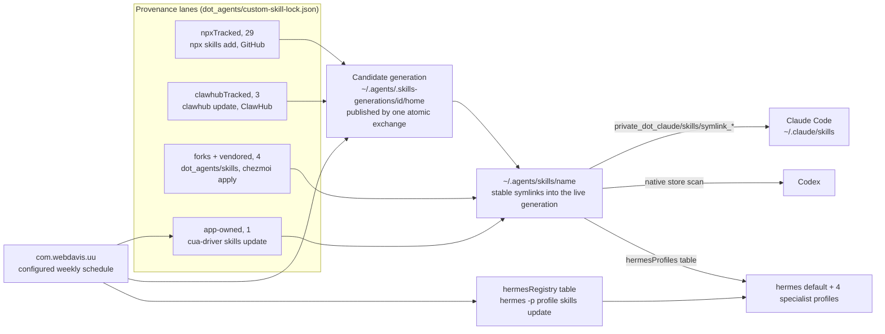

# Agent skills: the cross-harness store

`~/.agents/skills` is the single canonical skills store (37 roster skills). It serves Claude Code for the
roster minus the `claudeDelivery` `"none"` set (symlinks declared in chezmoi:
`private_dot_claude/skills/symlink_*`), Codex always (it scans the store natively, no declarations), and
hermes for exactly the store-symlink subset of the delivery model below
(`private_dot_hermes/private_skills/` and `private_dot_hermes/profiles/<name>/private_skills/` symlinks).

The committed roster is the complete wanted set. Its tables, per-harness declarations and settings
entries are maintained together by review. The updater validates the fields it consumes before it changes
the store.

The graph shows the lanes. The per-skill rows (which lane, which upstream, which tier, which profiles)
live in `dot_agents/custom-skill-lock.json`, which is the thing to read for any individual skill.

## Store provenance: who installs and refreshes each store copy

The lock at `dot_agents/custom-skill-lock.json` records it.

### npx-tracked (the `npxTracked` table, 29 skills)

The store copy is installed and refreshed by the official npx `skills` CLI from an official GitHub
upstream, latest from `main` (no pin). `~/.cargo/bin/uu run skills` installs and refreshes them via an
explicit
`npx --yes skills@<configured-version> add <repo> --skill <name> --agent claude-code --agent codex -g -y`
per repo group, run against the weekly candidate generation. It never uses the bulk `npx skills update`,
whose lock-walk logs some failures at exit 0; the explicit add also reconciles lock-absent roster skills.
Codex reads the store natively, so there is no Codex-side declaration. These skills are NOT vendored in
chezmoi.

Includes the 12 curated HeyGen HyperFrames skills (router `hyperframes`; domains `hyperframes-core`,
`-animation`, `-keyframes`, `-creative`; `media-use`, `hyperframes-cli`, `hyperframes-registry`;
workflows `general-video`, `faceless-explainer`, `embedded-captions`, `motion-graphics`), with `figma`,
`music-to-video` and the rest of that repo deliberately excluded.

Also includes `home-assistant-best-practices` (from the official `homeassistant-ai/skills` repo): Home
Assistant config and YAML authoring guidance, not runtime control. It complements the clawhub-tracked
`home-assistant` runtime skill everywhere, and it is the one Home Assistant skill that DOES fan out to
hermes (default profile), as authoring guidance atop Bob's native Home Assistant runtime tools.

Also includes the five `kepano/obsidian-skills` skills (`defuddle`, `json-canvas`, `obsidian-bases`,
`obsidian-cli`, `obsidian-markdown`), all on-demand, all `hermesProfiles: []`. Note what on-demand costs
`defuddle`: it advertises itself as an automatic substitute for WebFetch whenever a user pastes a URL, so
demoted it never fires unless the agent is told to use it. That is deliberate, and reverting it takes two
committed edits, the `tiers` value in the lock and the matching `skillOverrides` line in
`private_dot_claude/modify_settings.json`, so the declared tier and Claude behavior continue to agree.

Also includes `owasp-security` (from `agamm/claude-code-owasp`): the OWASP Top 10:2025 table, a
finding-triage rubric, the LLM and Agentic AI lists, and ASVS 5.0 requirement ids, as markdown with no
executable code. Its README installs with `npx degit` straight into `~/.claude/skills/`, which would land
a real directory beside the symlink declarations and reach Claude Code only; the npx lane sources the
same repo, so it goes here instead and gets a refresh path the degit copy would not have.

Also includes `lavish` (from `kunchenguid/lavish-axi`): a stub that teaches the agent to run
`npx -y lavish-axi`, which opens an agent-written HTML artifact in a browser for element and text-range
annotation and sends the feedback back. Nothing is installed for it, the CLI is fetched per run, so the
stub cannot go stale against a newer release.

### ClawHub-tracked (the `clawhubTracked` table, 3 skills)

`home-assistant`, `sql-toolkit` and `summarize-pro`. The store copy is installed and refreshed by the
`clawhub` CLI from ClawHub. The npx lane cannot source ClawHub (`npx skills add` is GitHub-only), so
ClawHub-only skills get their own auto-update lane instead of staying vendored. Each entry records the
owner-qualified slug and registry.

`uu run skills` installs an absent one in a throwaway `--workdir` and moves the CLI's output flat into
the candidate store. The CLI nests its output under `@owner/<name>`, and the code handles both that and a
flat `skills/<name>` path rather than assuming either; the skill's `.clawhub/origin.json` travels along
and pins the owner. The weekly lane then refreshes each in place with
`clawhub --workdir <candidate>/.agents --dir skills update <name> --no-input` (bare store names resolve
through `origin.json` even when several ClawHub users publish the name).

Finder `.DS_Store` metadata is removed from the owned candidate before a full refresh. The updater also
strips only its own Codex invocation policy before the package command, preserving upstream metadata, and
restores that policy afterward. Other local changes remain the package command's decision; a refused
update is a required failure and leaves the current generation untouched. Automation never passes
`--force` or `--force-install`. Additive bootstrap preserves healthy content.

### Vendored (committed under `dot_agents/skills/`, refreshed only by `chezmoi apply`)

The `forks` table records each one's upstream for weekly drift-watch. `moshi` and `herdr` are deliberate
content forks (`fork: true`). `elevenlabs` is vendored because npx cannot install it full-tree (its
`SKILL.md` sits at the repo root beside a `scripts/` dir npx drops, even with `--full-depth`).
`tiktok-crawling` is the one plain committed dir with no `forks` entry: a ClawHub-published skill left
vendored because hermes owns its hub copy via `hermesRegistry` and its hub name differs from the roster
name (`tiktok-scraping-yt-dlp`).

### App-owned symlink (`cua-driver`)

The store entry is a symlink into `~/.cua-driver`; the app owns the content. The official mechanism
covers all three harnesses (`cua-driver skills status` links Claude Code, Codex via the store, and hermes
itself), and the weekly run refreshes the pack via `cua-driver skills update`, the app's own
GitHub-Releases updater, never a write through the symlink.

## Claude delivery (the lock's `claudeDelivery` table)

A store entry mapped to `"none"` is one this vertical deliberately does NOT deliver to Claude Code. It
carries no `private_dot_claude/skills` declaration and `uu run skills` skips it in the weekly Claude
fan-out, so a `~/.claude/skills` link removed by hand stays removed instead of coming back on the next
weekly run. An absent key is the default, a store symlink. `last30days` is the one entry today.

The table states only what THIS vertical does: it names no other delivery mechanism and reads no other
lock, per the operator's strict-decoupling ruling. `"none"` is the only legal value, and a malformed
table refuses the run rather than failing open, before either weekly execution or bootstrap.

**Retiring an EXISTING link is manual, and the run says so.** Deleting the chezmoi declaration does not
remove a `~/.claude/skills` link already on the machine (chezmoi never deletes a target it no longer
manages), and the apply-time `uu bootstrap skills` pass preserves existing destinations. The link
therefore survives until the next full weekly run reaps it, and for that window Claude Code sees two
sources under one name. Additive fan-out warns with the absolute path in the additive mode, naming what
it is leaving behind for the operator to delete. The operator handles any retirement needed before the
next full weekly run.

## Tier model (the lock's `tiers` table)

Every roster skill is `core` (8) or `on-demand` (27). Core skills auto-load in every harness; on-demand
skills stay installed everywhere but load only when explicitly invoked:

- Claude Code: `skillOverrides.<name> = "user-invocable-only"`, one `setValueAtPath` per skill in the
  settings modify-template. The write is per key, so overrides the user sets for other skills drift
  freely.
- Codex: an additive `agents/openai.yaml` carrying `policy: allow_implicit_invocation: false`. Codex then
  never auto-invokes the skill, while explicit `$name` invocation keeps working.

The overlay is committed next to each on-demand vendored skill; core vendored skills carry none, and the
candidate overlay pass strips only the managed policy block from core skills. For npx- and
clawhub-tracked skills (whose folders the add and update passes replace wholesale) `uu run skills`
re-asserts the overlay on every run from the tiers table, and when an upstream skill ships its own
`agents/openai.yaml` the policy is APPENDED so upstream metadata survives, never overwritten. Store
entries that are SYMLINKS to app-owned content (`cua-driver`) never get an overlay, since writing through
the link would modify content this repo does not own, so `cua-driver` stays implicitly invocable in Codex
(a deliberate, documented asymmetry).

## Hermes delivery is two-lane, under the five-profile architecture

The profiles are default (Bob), elaine, butters, concerned and nicodemus.

### Store-symlink lane (the lock's `hermesProfiles` table)

The store copy is symlinked into the named profiles' `skills/` dirs (`default` = `~/.hermes/skills`, a
specialist = `~/.hermes/profiles/<name>/private_skills`), declared in chezmoi and re-asserted by
`uu run skills` at run time, which creates a profile `skills/` dir when absent. `[]` means the store copy
reaches no hermes profile. Fan-out is driven ENTIRELY by this table: non-empty means symlink, `[]` means
do not.

The live-truth map: default = `herdr`, `moshi`, `lobster`, `todoist-cli`, `summarize-pro`,
`home-assistant-best-practices`; butters = `chrome-devtools-axi`; concerned = `elevenlabs`, `last30days`;
elaine = `lobster`; nicodemus = `gh-axi`, `kubernetes-specialist`, `sql-toolkit`. `home-assistant` maps
to `[]`: hermes carries native Home Assistant runtime tools, so the runtime skill would be redundant
there, and its store copy serves Claude and Codex only. The authoring companion,
`home-assistant-best-practices`, is what default carries.

### Hermes-owned lane (the lock's `hermesRegistry` table)

Hermes installed the skill from a registry (skills.sh, ClawHub, or the official registry) and owns a real
hub dir in the profile. The weekly `uu run skills` hermes phase keeps these fresh:
`hermes -p <profile> skills update <lockKey>` per entry, keyed by the entry's `lockKey`, never a list
name (a ClawHub slug can differ from the skill's frontmatter name: `tiktok-crawling` installs
`tiktok-scraping-yt-dlp`).

These skills have NO store symlink declaration, because a store symlink would shadow the hub-owned dir,
which is why `hermesRegistry` and the non-empty `hermesProfiles` set are DISJOINT.

A blocked or refused update does not stop the walk: it records a required failure and preserves its
output, so remaining entries are still attempted and uu withholds its success marker. Automation never
passes `--force` (bypassing a security scan needs per-invocation operator confirmation) and never
uninstalls. `held: true` skips a skill visibly (none currently held). The default profile (Bob) is walked
like any other, its un-entanglement is done (2026-07-09), and with `sql-toolkit` and `summarize-pro`
since moved to the clawhub-tracked store lane, the registry table holds no default-profile entry:
`conventional-commits` in nicodemus, the rest in concerned. The retired hub installs (nicodemus
`sql-toolkit`, default `summarize-pro`) are unowned live state to hand-remove, never automated.

### Harness-specific lane, outside the store (`babysit`)

One skill is delivered to hermes as a real chezmoi-managed directory,
`private_dot_hermes/private_skills/babysit/`, with no store copy and no lock row. It is the entry point
to babysitter's orchestration CLI, and the three harness plugins each ship their own copy of it differing
only in the harness name it hardcodes (`--harness hermes` against `codex` against `claude-code`).

A store copy would therefore be wrong by construction. Codex scans the store natively with no per-skill
opt-out, so a hermes-flavoured `babysit` there would put a second skill of that name in front of Codex
telling it to run `--harness hermes`, which is the collision the catalog-first rule below forbids. Claude
Code and Codex get their correct copies from the babysitter plugin instead; only hermes, which cannot
load that plugin at all, needs a file.

`treefmt.toml` excludes `private_dot_hermes/private_skills/**` from mdformat, for the same reason
`dot_agents/**` is excluded: it is vendored skill content with YAML frontmatter mdformat would mangle.

**Its dependency section is deliberately not upstream's.** Upstream's block reads a pinned SDK version
out of a `versions.json` beside the plugin bundle and `npm i -g` installs it. Hermes sets no
`PLUGIN_ROOT` and this delivery ships no `versions.json`, so that resolver produces `latest`, and the
install line then downgrades the machine's pinned CLI for every tool that shares it. The local copy uses
the already-installed `babysitter` and installs nothing at all; a missing CLI is reported rather than
repaired. Keep it that way when porting anything else from upstream.

It carries no `forks` drift-watch entry, and that is deliberate rather than an omission. The rest of the
file is a stub whose body tells the agent to run `babysitter instructions:babysit-skill --harness hermes`
and follow what comes back, so the instructions that matter are fetched at run time from the CLI pinned
in `.chezmoidata/system_packages_autoinstall.yaml`. Re-compare it against `a5c-ai/babysitter-hermes`
`skills/babysit/SKILL.md` when that pin is bumped, which is the only moment its content can meaningfully
have moved.

### Name collisions

Collisions resolve catalog-first (operator ruling): the `humanizer` and `hyperframes` store copies serve
Claude and Codex only and are never symlinked hermes-side, since hermes gets those names from its own
catalog or hub. `summarize-pro` and `todoist-cli` left the collision set: their only hermes copies were
hub installs (since retired), so no catalog copy wins those names and the store symlink is the wanted
delivery. Review these ownership decisions when changing the delivery tables.

## Superpowers to hermes routing (the lock's `superpowersRouting` table)

The live `~/.hermes/skills/hermes-superpowers/` mirror is hand-patched so the five skills with
hermes-native adaptations (`writing-plans`, `requesting-code-review`, `subagent-driven-development`,
`systematic-debugging`, `test-driven-development`) are referenced by their adaptation names instead of
`superpowers:<name>`, keeping the workflow out of the disabled legacy duplicates.

The mapping lives in the lock's `superpowersRouting` table, and
`~/.local/libexec/unattended-upgrades/agent-skills/assert-hermes-superpowers-routing.sh` re-asserts it
idempotently on every `uu run skills` run and after any superpowers re-mirror. A re-assert that fixes
anything is recorded in the lane report; a failed repair counts as a required failure.
`assert-hermes-superpowers-routing.sh --check` is the health probe: non-zero lists the stale files and
changes nothing. Scope is the hermes mirror ONLY. Claude Code's superpowers plugin keeps its
`superpowers:*` references untouched.

## Local forks (`moshi`, `herdr`)

They deliberately diverge from upstream, so `uu run skills` never touches them. When updating them, or
when their upstreams ship new features, first compare against upstream
(https://herdr.dev/docs/preview/agent-skill/ and https://getmoshi.app/skill), then port wanted changes
into the vendored copy by hand. A `note` on a `forks` entry records anything a future maintainer would
otherwise have to re-derive (why `elevenlabs` is vendored without being a content fork; why `herdr`'s
recorded hash deliberately lags its `skillPath`); the entries carry no line-by-line divergence log. The
weekly run drift-checks the `forks` upstreams and reports changes as pending work in the combined uu
record. Pending work escalates after the configured number of runs, three in the shipped skills lane.
After the hand comparison, bump that fork's `lastComparedTreeHash` to the new upstream hash.

Each outcome keeps its own advisory state, because the remedies differ:

- **Drift** (`FORK DRIFT`, `fork-drift`) means upstream content moved, so compare and port, then bump the
  hash.
- **A missing path** (`FORK PATH MISSING`, `fork-path-missing`) means the upstream is fine but the
  recorded `skillPath` is gone, so re-point `skillPath` and leave `lastComparedTreeHash` alone: bumping
  it would silence a comparison nobody has made.
- **An unreachable upstream** (`FORK UNREACHABLE`, `fork-upstream-unreachable`) means the fetch failed,
  and the log carries git's own message so a renamed, deleted or newly private upstream is not filed
  under "check your network" forever.
- **An upstream with no usable HEAD** (`FORK NO UPSTREAM HEAD`, `fork-upstream-headless`) cloned fine and
  has no commit to compare against, so the default branch was renamed or the repository is empty, and the
  recorded `skillPath` is not what is missing.
- **An unstageable clone** (`fork-clone-unstageable`) means there was no temp dir to fetch into, so
  nothing was compared.
- **A clone that never answered** (`FORK CLONE TIMED OUT`, `fork-clone-timeout`) means the fetch was
  still running at its deadline (five minutes within the lane budget) and was stopped.
- **A broken lock** (`fork-lock-broken`, `fork-lock-missing`, `fork-walk-incomplete`) means the `forks`
  table, one of its entries, or the walk itself could not be used, so some or every upstream went
  unwatched.
- **A lock with no `forks` table at all** (`fork-table-absent`) is reported rather than read as a clean
  zero-entry watch: an empty `{}` is how a lock says there is deliberately nothing to watch, while an
  absent key is what a typo or a dropped table leaves behind, and that used to print what a healthy run
  prints.

Each clone has a five-minute deadline within the run's remaining budget. Clone failures and drift stay
pending rather than failing the skills refresh. The report names the fork and retains the Git error;
lock-level failures use their own state. Git runs with inherited configuration cleared, including system,
global and command-scope settings, so URL rewrites cannot silently select a different upstream.

The `forks` table is ADVISORY data: nothing in the mutating path reads it, so a malformed table or entry
is reported by the watch and never refuses the weekly update (an unquoted `lastComparedTreeHash`, the one
field edited by hand after clearing a drift, used to refuse every slot). Its shape is checked by the
advisory watch without blocking publication.

## Generation-exchange updates

Every npx- and clawhub-tracked skill lives inside ONE live generation directory,
`~/.agents/.skills-current` (real dirs under `skills/`, the npx CLI lock, and `generation.json` as the
ready marker). The store names `~/.agents/skills/<name>` are stable symlinks into it and
`~/.agents/.skill-lock.json` is a symlink to its lock, so sibling references like `../hyperframes-core`
stay coherent within one generation.

The weekly run builds a candidate generation as a fake HOME under
`~/.agents/.skills-generations/<id>/home`, runs the package-CLI lanes against it under `env -i` (HOME,
the XDG dirs, TMPDIR and the npm cache all pinned inside), validates the whole candidate, and publishes
with the platform's atomic directory exchange. A fresh store uses a first rename. A lane or validation
failure discards the owned candidate workspace and leaves the current generation untouched. Recovery
validates interrupted publications and retains their journal and outgoing ownership until pruning and
cleanup succeed.

The honest guarantee: any path resolution during or after the exchange yields a complete tree from
exactly one generation; a session that cached a resolved path keeps a complete previous generation until
the next publication retires that previous generation, then gets a clean ENOENT, never partial content.

Out-of-band writers (the HyperFrames workflows self-update via `npx hyperframes skills update`,
upstream-controlled, no supported disable) bypass this exactly as they always did; the weekly recovery
pass detects a store real dir where a link is expected and re-absorbs that content into the next
candidate.

Ready candidates record the roster and updater digests captured for the run. Recovery reuses compatible
full candidates; otherwise a new candidate is built. The combined uu record carries required failures and
pending fork work, and uu owns the success marker and per-lane escalation history. Explicit npx adds
target Claude Code and Codex; other harness delivery comes from the declared profile map.

## Schedule

The skills lane runs with the configured `uu` weekly job. `just update-skills` invokes
`~/.cargo/bin/uu run skills` manually. There is no activity gate or separate Monday retry window. The uu
run lock prevents concurrent uu execution; a refused bootstrap exits 1 and its apply wrapper retains
`~/.local/state/skills/first-install-pending` for the next apply.

Before the cutover apply, the operator stops `com.webdavis.update-skills` and waits for old updater and
manual `live-reconcile` invocations to finish. Source retirement cannot stop an already loaded job. The
operator then performs a full apply, which installs uu and runs `uu bootstrap skills`. Bootstrap repairs
absent or unhealthy roster entries additively, preserving healthy content and existing links. It still
creates missing Hermes destinations when no publication is needed. Manual `live-reconcile` remains
separate from running uu jobs.

After successful bootstrap, the operator may remove the retired updater plist, script, skills log tree
and `~/.local/state/update-skills/`. Preserve `~/.local/state/skills/` and any in-flight generation
state. A failed or contended bootstrap retains and advances its retry marker; only success clears it.

## Adding a skill

1. Pick the lane. An official full-tree GitHub upstream gets an `npxTracked` entry
   (`{"repo": "owner/repo"}`). A ClawHub-published skill gets a `clawhubTracked` entry
   (`{"slug": "@owner/name", "registry": "https://clawhub.ai"}`). Anything else is vendored under
   `dot_agents/skills/`, with a `forks` drift-watch entry when it has a watchable upstream.
1. Add its row to `tiers`, plus the `skillOverrides` template entry and the `agents/openai.yaml` overlay
   when on-demand.
1. Add its `hermesProfiles` row (`[]` when hermes should not carry it from the store, the named profiles
   when it should). Add a `hermesRegistry` entry instead when hermes owns it from a registry; never both
   a non-empty `hermesProfiles` mapping and a `hermesRegistry` entry, they are disjoint.
1. Declare its Claude symlink, unless it gets a `claudeDelivery` `"none"` row instead, and, only for
   store-symlinked skills, the mapped hermes symlinks.
1. Review every roster table and harness declaration together, then run `just test`.
1. The operator applies the change; `uu bootstrap skills` repairs missing entries additively.

**Removing one:** delete the store entry (or `npxTracked` row), every lock table row, and every
declaration in the same commit.

## On-demand use of an unregistered skill

Point the agent at the file: "read `~/.agents/skills/<name>/SKILL.md` and follow it." Router and
search-and-load indirection layers were evaluated and rejected (measured lossy and slow at this library
size). Hermes's larger native catalog (`~/.hermes/skills/<category>/`) remains Hermes-only.

## Plugin update record

Claude Code updates marketplaces and their installed plugins at startup (see `extraKnownMarketplaces` in
`docs/runbooks/claude-code-settings.md`). The `claude-plugins` lane in `uu` records those changes in the
combined weekly entry. It does not install or upgrade plugins.

- **Source:** the configured `inventory` path, normally `~/.claude/plugins/installed_plugins.json`. Only
  user-scope records are tracked. Invalid record shapes fail the whole reading; an inventory containing
  only other scopes is a valid empty reading.
- **Fingerprint:** a nonempty `version` other than `unknown`, then a nonempty `gitCommitSha`, then
  `unknown`. `lastUpdated` is not a fingerprint because marketplace refreshes can change it without a
  plugin update. Records contain plugin identifiers and fingerprints, never installation paths or
  marketplace source URLs.
- **State:** `~/.local/state/uu/lanes/claude-plugins/snapshot.tsv`. An existing uu snapshot wins.
  Otherwise, the lane validates and atomically imports the old
  `~/.local/state/report-plugin-updates/installed-plugins.snapshot`, including an empty snapshot,
  preserving its bytes and leaving the legacy file alone. It seeds fresh only when both are absent.
  Failed reads, validation and publication fail the lane without reseeding.
- **Delivery timing:** the lane advances its snapshot during the run, before uu delivers the combined
  record. This differs from the retired bash reporter: a refused record can leave that comparison absent
  from the next run. Snapshot publication is atomic, and a publication failure is reported.
- **Bootstrap:** `~/.cargo/bin/uu bootstrap claude-plugins` takes the run lock, seeds or imports the
  baseline, and prints its report. It sends no record or alert and changes no success marker or streak.
  Repeated bootstrap keeps existing history without consuming its pending comparison.
- **Apply ordering:** script 69 invokes bootstrap after uu is deployed. This is the same apply that
  enables marketplace auto-updates, so nothing between the settings write and the seed may start Claude
  Code. Seed failure is nonfatal and leaves the next run to retry.
- **Cutover:** before a full apply, the operator stops the old `com.webdavis.report-plugin-updates` job.
  After confirming migration, the operator trashes the old plist, reporter, plugin-report log and legacy
  state. Source retirement does not unload an already running job.
